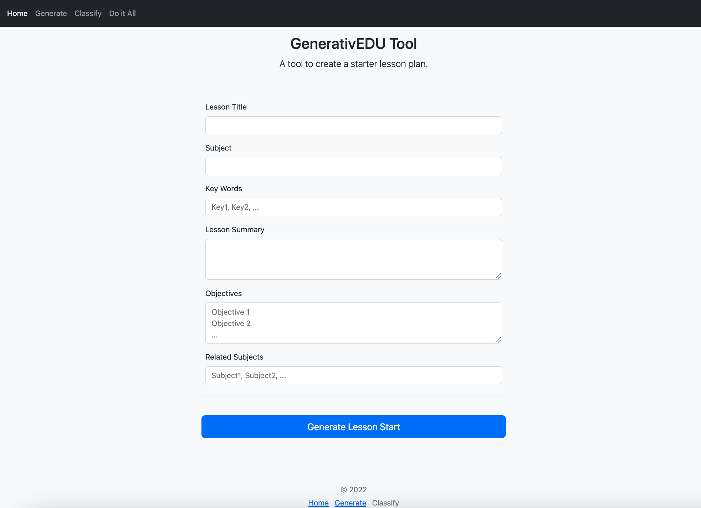

# GenerativEDU
LA Hackers submission for LabLabAI's Generative AI Hackathon

### Authors
* @Pikajay
* @PokeManiac692

GenerativEDU is an AI solution to building dynamic lessons designed by educators for educators.
This Python Web App uses Cohere's Generative AI tools to create a lesson plan starter based off of a few pieces of information.

Technologies Used:
* Cohere
* Python
* Flask
* Notion API
* Bootstrap

### Links:
[Presentation](https://docs.google.com/presentation/d/1N63s9mvfw-H39uqWwcT9ESD0eoxzY8EilBl5cvTQpxo/edit?usp=sharing)

### Next Steps:
* Refactor and Optimize Code
* Build out Classify and Full Lesson Plan Generator Tools
* Build up documentation
